# Process Scheduling
## 1. Program design
### 1.1 Process struct

建立一個陣列來儲存每個 Process 的資訊，每一格陣列儲存的資訊包含了
```
typedef struct Process
{
    char name[32];
    int ready_time;
    int exec_time;
    pid_t pid;
    int start;
    int end;
} Process;
```
### 1.2 Structure of  `scheduling()`
``` sh
1. 初始化 process 陣列，根據每個 process 的準備就緒時間的順序排列。

2. 開始排班
    2.1 遍歷每個 process，檢查是否有 process要準備執行。
    2.2 透過排班演算法選擇下一個要執行的 process。
    2.3 內容轉換 (context switch)。
    2.4 執行目前選擇的 process 一個時間單位。
    2.5 檢查目前選擇的 process 是否已經執行完畢。
    2.6 更新 last_id 為目前選擇的 process 的 ID。
```

### 1.3 Scheduling algorithm
#### 1.3.1 First-Come, First-Served Scheduling
* 原理
    * 先來的 process 先做。
* 作法
    ```sh
    If (curr no process runnning || curr process is finishing)
    {
        For each process p_i
        {
            If p_i is ready
            {
                choose p_i as next running process
                break
            }
        }
    }
    ```
#### 1.3.2 Shortest Job First (SJF)
* 原理
    * 執行時間較短的 process 先做，但是如果當前其他process ready 時，則需等待當前正在執行的process執行完時才可以執行。
* 作法
    ```
    If (curr no process runnning || curr process is finishing)
    {
        For each process p_i
        {
            If p_i is finishing
            {
                continue;
            }
            If (p_i is ready && the process is shorter than berfore)
            {
                choose p_i;
            }
        }
    }
    ```
#### 1.3.3 Preemptive Shortest Job First (PSJF)
* 原理
    * 先執行準備好與時間較短的 process ($p_1$)，如果其他 process ready 時 ($p_2$)，則需比較 $p_1$ 的 remaining time 與 $p_2$ 的 execution time。最後選擇執行時間較短的process。
* 作法
    ```sh
     For each process p_i
    {
        If p_i is finishing
        {
            continue;
        }
        compute the p_i remaining time
        If (p_i is ready && the remaining time is shorter than berfore)
        {
            choose p_i;
            updating the remaining time;
        }
    }
    ```
#### 1.3.4 Round-Robin Scheduling
* 原理
    * 給當前準備好的 process 執行一段時間(`TQ_TIME`)，如果尚未執行完畢，則把當前的process 放進 `rr_queue` 等待，再從 `rr_queue` 中選出下一個 process 執行。
* 作法
    ```sh
    If (curr no process runnning || curr process is finishing || need to change process, rr==0)
    {
        swap rr_queue, move first process to last and the others process move forward with the same order
        choose first process in rr_queue
    }
    set rr=TQ
    ```

## 2. Test results
### 2.1 FCFS
* FIFO_1.txt

    資料內容
    ```sh
    FIFO
    5
    P1 0 500
    P2 0 500
    P3 0 500
    P4 0 500
    P5 0 500
    ```
    執行結果
    ```sh
    P1 0 500
    P2 500 1000
    P3 1000 1500
    P4 1500 2000
    P5 2000 2500
    ```
    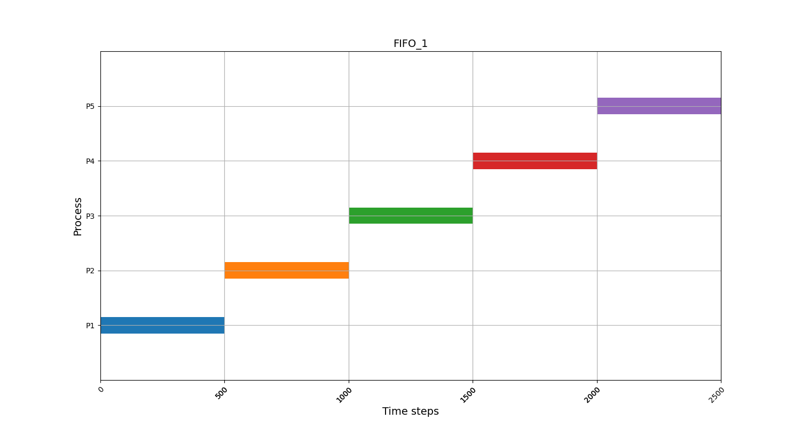

* FIFO_2.txt

    資料內容
    ```sh
    FIFO
    4
    P1 0 80000
    P2 100 5000
    P3 200 1000
    P4 300 1000
    ```
    執行結果
    ```
    P1 0 80000
    P2 80000 85000
    P3 85000 86000
    P4 86000 87000
    ```
    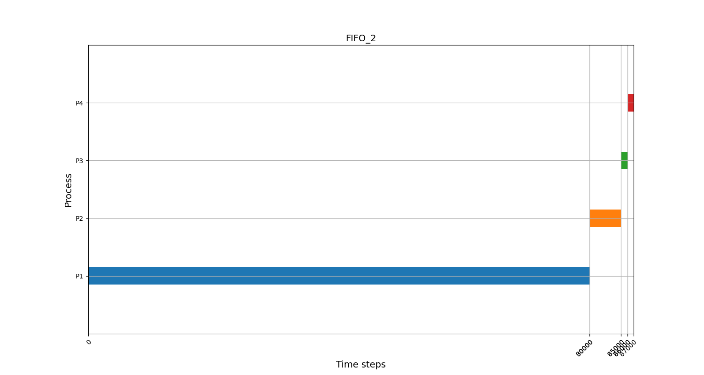
* FIFO_3.txt

    資料內容
    ```sh
    FIFO
    7
    P1 0 8000
    P2 200 5000
    P3 300 3000
    P4 400 1000
    P5 500 1000
    P6 500 1000
    P7 600 4000
    ```
    執行結果
    ```
    P1 0 8000
    P2 8000 13000
    P3 13000 16000
    P4 16000 17000
    P5 17000 18000
    P6 18000 19000
    P7 19000 23000
    ```
    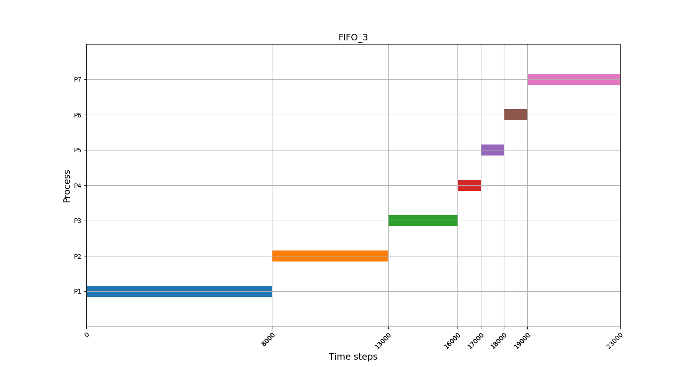
* FIFO_4.txt

    資料內容
    ```
    FIFO
    4
    P1 0 2000
    P2 500 500
    P3 500 200
    P4 1500 500
    ```
    執行結果
    ```
    P1 0 2000
    P2 2000 2500
    P3 2500 2700
    P4 2700 3200
    ```
    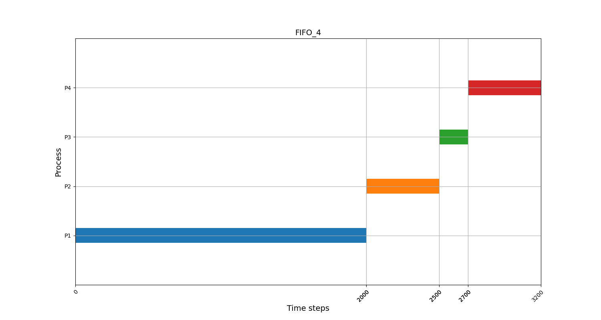
* FIFO_5.txt

    資料內容
    ```
    FIFO
    7
    P1 0 8000
    P2 200 5000
    P3 200 3000
    P4 400 1000
    P5 400 1000
    P6 600 1000
    P7 600 4000
    ```
    執行結果
    ```
    P1 0 8000
    P2 8000 13000
    P3 13000 16000
    P4 16000 17000
    P5 17000 18000
    P6 18000 19000
    P7 19000 23000
    ```
    
### 2.2 SJF
* SJF_1.txt

    資料內容
    ```
    SJF
    4
    P1 0 7000
    P2 0 2000
    P3 100 1000
    P4 200 4000
    ```
    執行結果
    ```
    P1 100 200
    P3 200 400
    P2 400 4400
    P4 4400 8400
    P5 8400 15400
    ```
    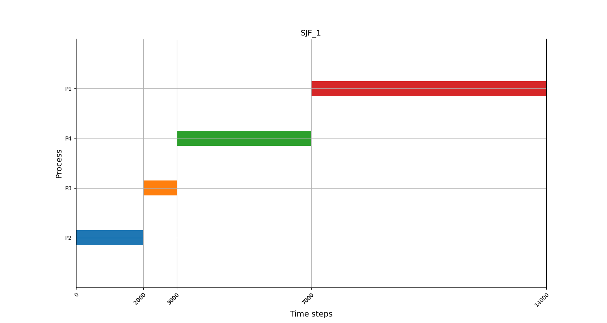
* SJF_2.txt
    資料內容
    ```
    SJF
    5
    P1 100 100
    P2 100 4000
    P3 200 200
    P4 200 4000
    P5 200 7000
    ```
    執行結果
    ```
    P1 100 200
    P3 200 400
    P2 400 4400
    P4 4400 8400
    P5 8400 15400
    ```
    
* SJF_3.txt
    資料內容
    ```
    SJF
    8
    P1 100 3000
    P2 100 5000
    P3 100 7000
    P4 200 10
    P5 200 10
    P6 300 4000
    P7 400 4000
    P8 500 9000
    ```
    執行結果
    ```
    P1 100 3100
    P4 3100 3110
    P5 3110 3120
    P6 3120 7120
    P7 7120 11120
    P2 11120 16120
    P3 16120 23120
    P8 23120 32120
    ```
    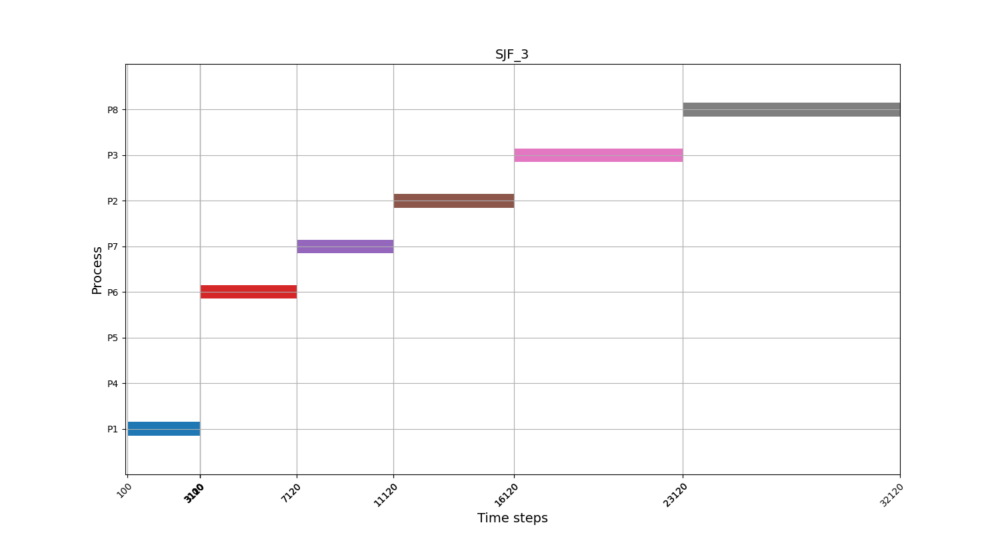
* SJF_4.txt
    資料內容
    ```
    SJF
    5
    P1 0 3000
    P2 1000 1000
    P3 2000 4000
    P4 5000 2000
    P5 7000 1000
    ```
    執行結果
    ```
    P1 0 3000
    P2 3000 4000
    P3 4000 8000
    P5 8000 9000
    P4 9000 11000
    ```
    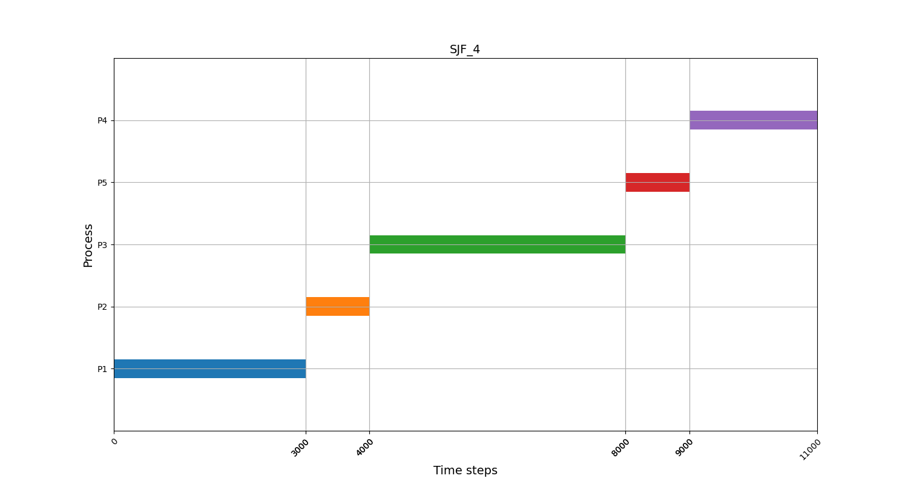
* SJF_5.txt
    資料內容
    ```
    SJF
    4
    P1 0 2000
    P2 500 500
    P3 1000 500
    P4 1500 500
    ```
    執行結果
    ```
    P1 0 2000
    P2 2000 2500
    P3 2500 3000
    P4 3000 3500
    ```
    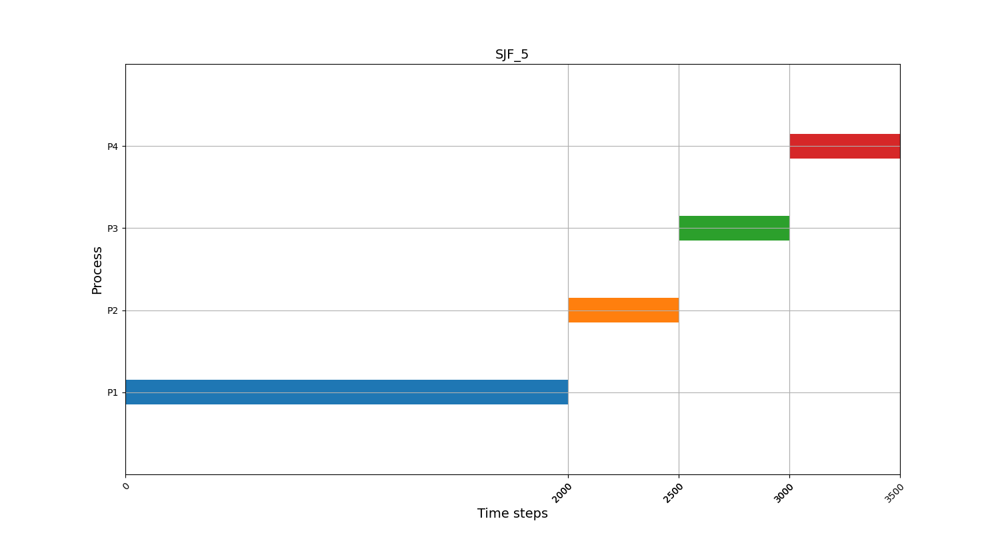
### 2.3 PSJF
* PSJF_1.txt
    資料內容
    ```
    PSJF
    4
    P1 0 10000
    P2 1000 7000
    P3 2000 5000
    P4 3000 3000
    ```
    執行結果
    ```
    P4 3000 6000
    P3 2000 10000
    P2 1000 16000
    P1 0 25000
    ```
    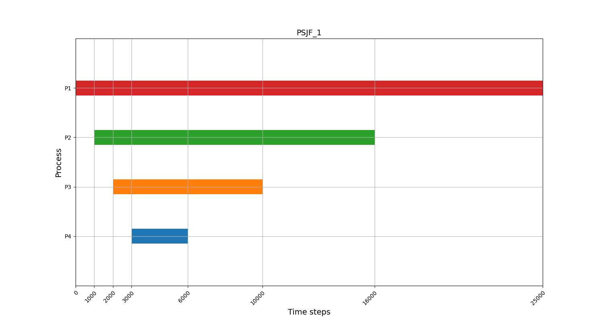
* PSJF_2.txt
    資料內容
    ```
    PSJF
    5
    P1 0 3000
    P2 1000 1000
    P3 2000 4000
    P4 5000 2000
    P5 7000 1000
    ```
    執行結果
    ```
    P2 1000 2000
    P1 0 4000
    P4 5000 7000
    P5 7000 8000
    P3 4000 11000
    ```
    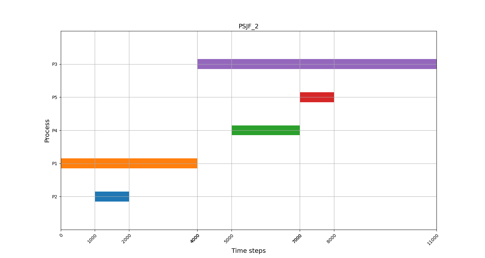
* PSJF_3.txt
    資料內容
    ```
    PSJF
    4
    P1 0 2000
    P2 500 500
    P3 1000 500
    P4 1500 500
    ```
    執行結果
    ```
    P2 500 1000
    P3 1000 1500
    P4 1500 2000
    P1 0 3500
    ```
    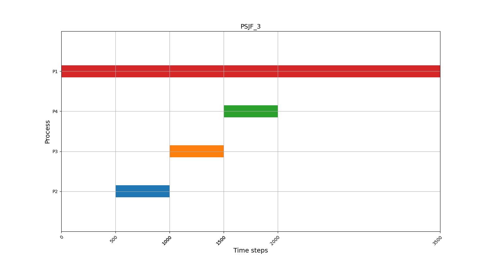
* PSJF_4.txt
    資料內容
    ```
    PSJF
    4
    P1 0 7000
    P2 0 2000
    P3 100 1000
    P4 200 4000
    ```
    執行結果
    ```
    P3 100 1100
    P2 0 3000
    P4 3000 7000
    P1 7000 14000
    ```
    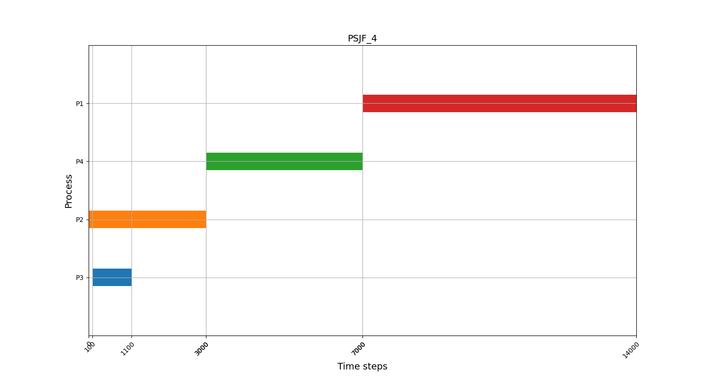
* PSJF_5.txt
    資料內容
    ```
    PSJF
    5
    P1 100 100
    P2 100 4000
    P3 200 200
    P4 200 4000
    P5 200 7000
    ```
    執行結果
    ```
    P1 100 200
    P3 200 400
    P2 400 4400
    P4 4400 8400
    P5 8400 15400
    ```
    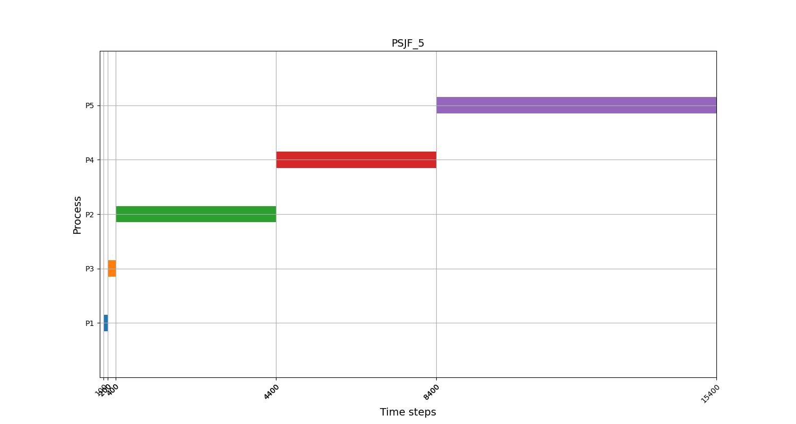
### 2.4 RR
* RR_1.txt
    資料內容
    ```
    RR
    5
    P1 0 500
    P2 0 500
    P3 0 500
    P4 0 500
    P5 0 500
    ```
    執行結果
    ```
    P1 0 500
    P2 500 1000
    P3 1000 1500
    P4 1500 2000
    P5 2000 2500
    ```
    
* RR_2.txt
    資料內容
    ```
    RR
    2
    P1 600 4000
    P2 800 5000
    ```
    執行結果
    ```
    P1 600 8100
    P2 1100 9600
    ```
    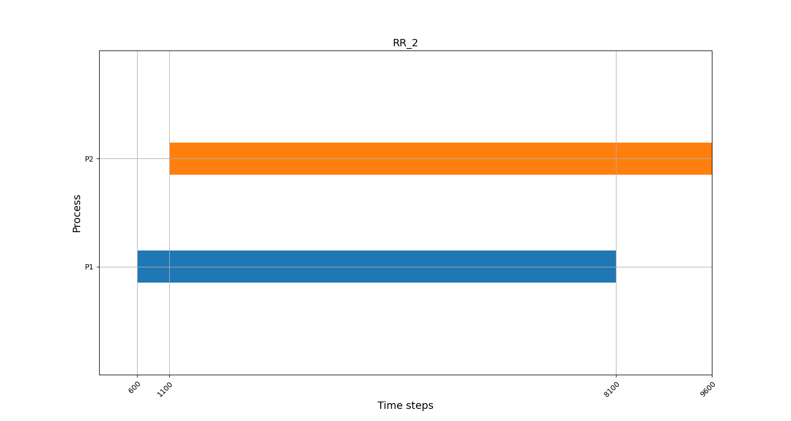
* RR_3.txt
    資料內容
    ```
    RR
    6
    P1 1200 5000
    P2 2400 4000
    P3 3600 3000
    P4 4800 7000
    P5 5200 6000
    P6 5800 5000
    ```
    執行結果
    ```
    P3 4200 18200
    P1 1200 19700
    P2 2700 20200
    P6 8200 28200
    P5 6700 30200
    P4 6200 31200
    ```
    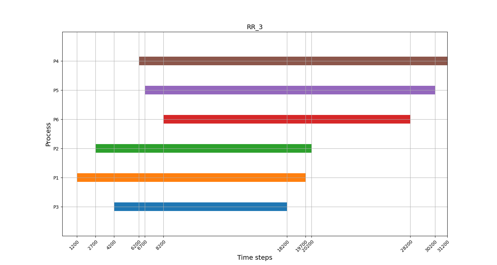
* RR_4.txt
    資料內容
    ```
    RR
    7
    P1 0 8000
    P2 200 5000
    P3 300 3000
    P4 400 1000
    P5 500 1000
    P6 500 1000
    P7 600 4000
    ```
    執行結果
    ```
    P4 1500 5500
    P5 2000 6000
    P6 2500 6500
    P3 1000 14500
    P7 3500 18500
    P2 500 20000
    P1 0 23000
    ```
    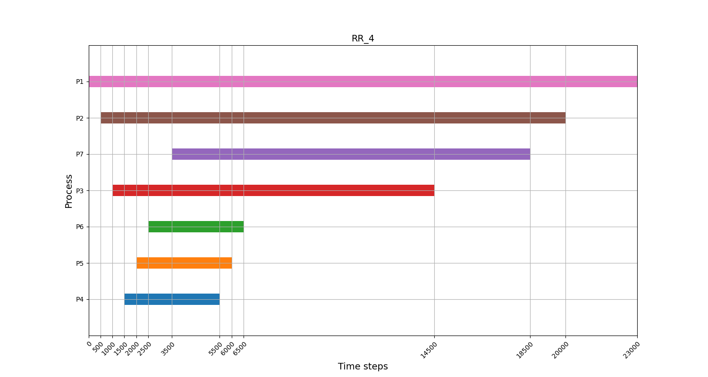
* RR_5.txt
    資料內容
    ```
    RR
    7
    P1 0 8000
    P2 200 5000
    P3 200 3000
    P4 400 1000
    P5 400 1000
    P6 600 1000
    P7 600 4000

    ```
    執行結果
    ```
    P4 1500 5500
    P5 2000 6000
    P6 3000 7000
    P3 1000 14500
    P7 3500 18500
    P2 500 20000
    P1 0 23000
    ```
    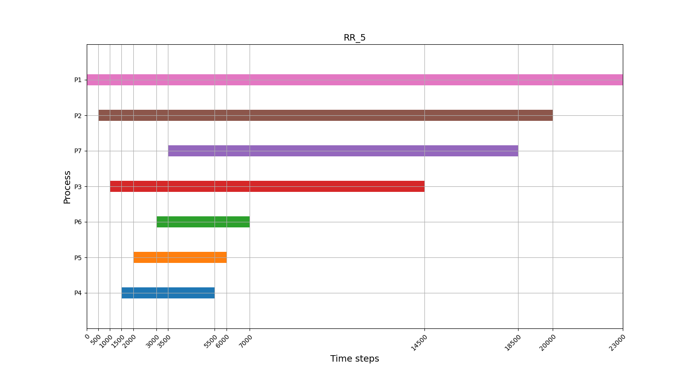
## 3. Usage
### 3.1 Build
```sh
make

// clean compile file
make clean
```
### 3.2 Run
```sh
./run_all.sh
```

## 4. Reference
1. Task Description
[Link](https://hackmd.io/@Ue96nvjESj2XsDXw532-qA/ryYqceUrU)


